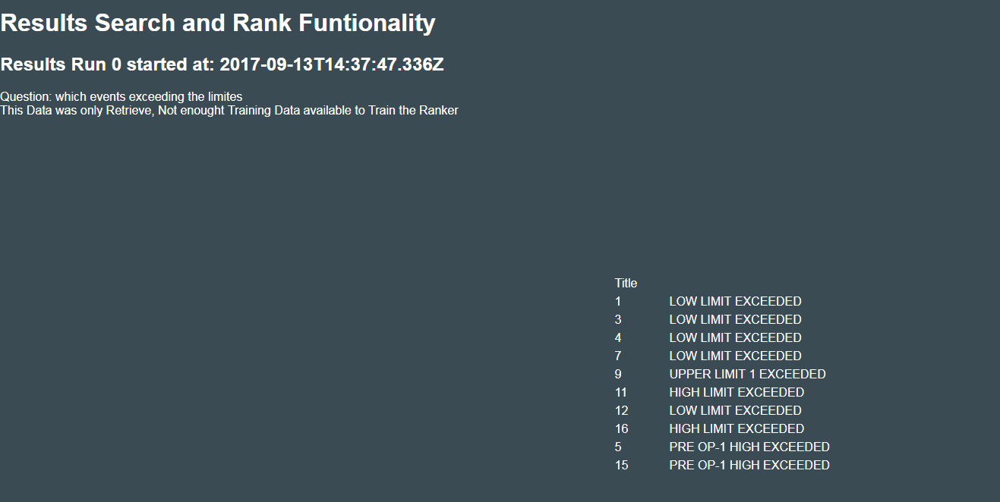

1, This is a web-based application;
2, You can run it locally by the command 'python server.py', and then look at the web 'http://127.0.0.1:8000/web/start';
3, You can also look at the results from Bluemix by clicking '	
python-demo-dittographic-nyctophobia.mybluemix.net' in our Bluemix account, and then add '/web/results' to the web address. 
The results will be shown;

4, Next step is to put our functions into the app and combine it with the API.
